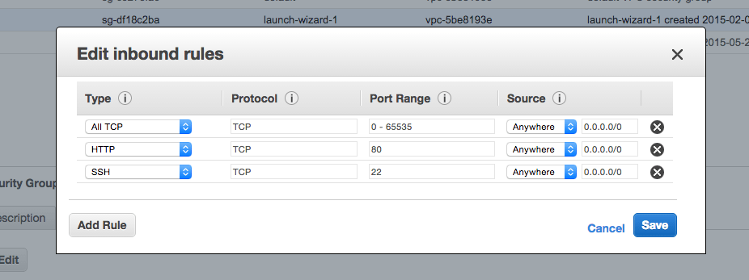

## Step 1 : Installing vsftpd server

vsftpd ( very secure ftp daemon ) is one of the popular ftp servers out there. After logging in to the ec2 instance, the following command will install vsftpd

```
sudo apt-get install vsftpd
```

## Step 2 : Make the following changes to the vsftpd conf file 

The configuration file can be opened up for editing at

```
sudo vim /etc/vsftpd/vsftpd.conf
```
And change/add the following flags:

```
anonymous_enable=NO
write_enable=YES
local_enable=YES
pasv_enable=YES
pasv_min_port=13000
pasv_max_port=13100
port_enable=YES
pasv_address=[public dns from the amazon EC2 instance]
pasv_addr_resolve=YES
local_root=/var/www/  ## Set path to access specific directory
```
After doing the above, we need to boost up or daemon again.

```
sudo service vsftpd restart
```

## Step 3 : Opening up port from the ec2 dashboard

Hop on to aws.amazon.com, login and go to your ec2 dashboard. Over there, for our particular instance, check the security group that it is a part of. Then hop on to that security group section and edit the rules of that particular security group as follows :

[ELB or EC2 security group] 

Notice that I’ve added the “All TCP” rule which will open up a range of ports for connection. Also note that we did not have a very strict security requirement, but if you are looking for that, then I would recommend opening up selective ports only.

## Step 4 : Create a user and make him owner of the root directory

In the ec2 instance console, just add a new user by

```
sudo adduser ftpuser
```

It will prompt you to enter details including the password. After we are done with that, we need to make this user the owner of the directory which we want him to be able to read/write. In my case it was the document root for apache, hence the following command :

```
sudo chown -R ftpuser:ftpuser /var/www/html/
```

## To delete users
```
userdel USERNAME
```

## Manage permission and role
```
Add user into group
# ubuntu = group name
# username = ftpuser

sudo usermod -a -G ubuntu ftpuser
sudo chown -R ftpuser:ubuntu /var/www/html
```

Errors like below then need to like suggested way

1 Vsftpd "425 Security: Bad IP connecting." error message.
> TO disable this check, add
```
pasv_promiscuous=YES
```
2 At time only one user logged in
> need to logout from one account and try

Other required changes you should need to follow below 
[vsftpd.conf](vsftpd.conf).